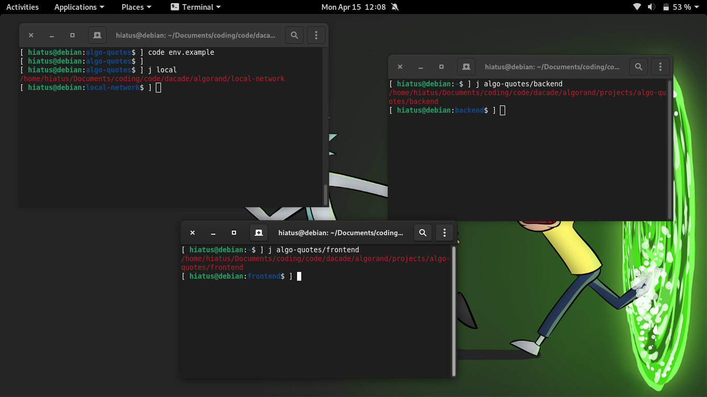
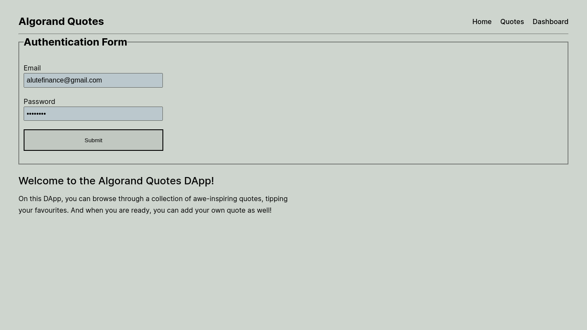
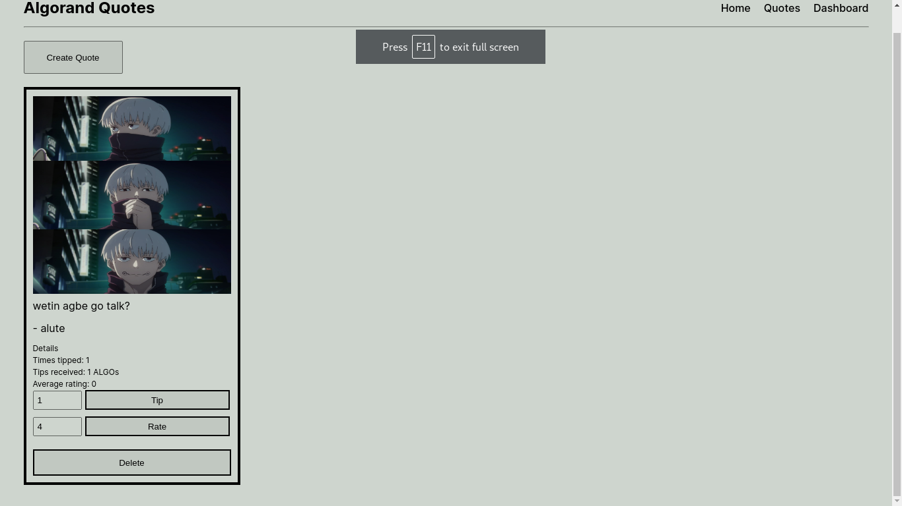
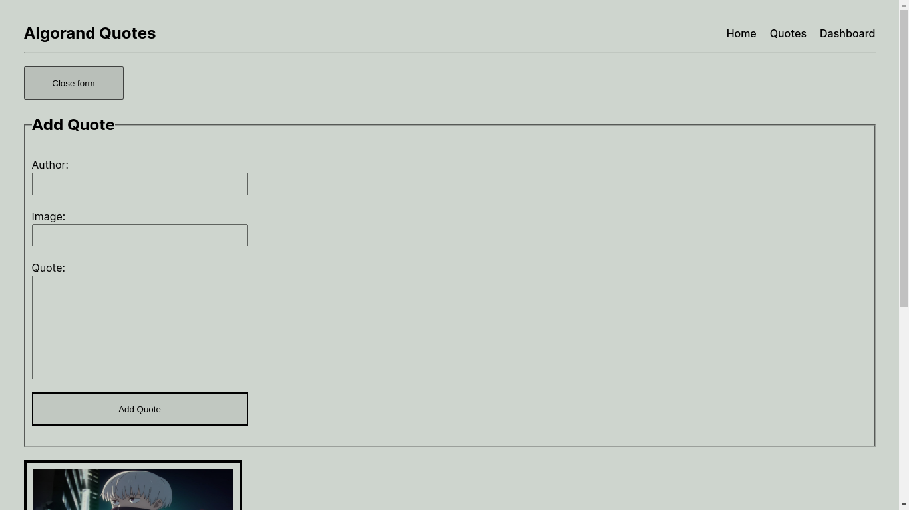
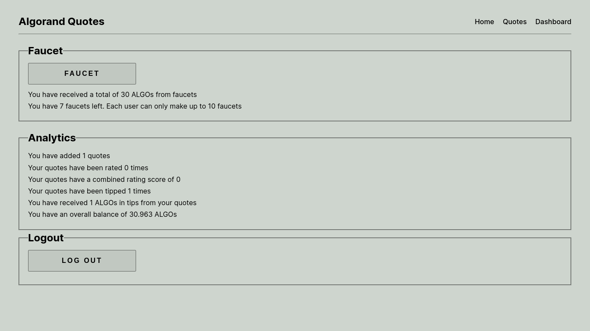

# ALGORAND QUOTES

This is a quote-sharing DApp built on the Algorand Blockchain using the following technologies:

- **contract**: Pyteal
- **backend**: Typescript, Node.js, Hono.js and Sqlite3
- **frontend**: React.js
- **blockchain network**: Algorand Sandbox

## How it works

Users can **create**, **rate**, **tip** and **delete** quotes. Some functions are not available to all users.

- a quote owner cannot tip or rate their own quote
- a user cannot delete a quote that they did not create


## Installation and Setup

NB: Make sure you have python3 and node.js v16+ installed before proceeding.

1. Head over to the [Algorand Sandbox website](https://github.com/algorand/sandbox) for instructions on how to download and start up the local blockchain network. After the installation, follow the below listed steps:
    - run this command to start up the blockchain network: `bash sandbox up`
    - run this command to list the accounts available: `bash sandbox goal account list`. The output of this command will be similar to the example output below:

        ```
        bash sandbox goal account list

        # [offline]	HCNMMIL3MKYILOLUO74NF6OPCJU4RU7IE5PX6JYBIT5YHAMQIVO5YADHMU	1000000000000000 microAlgos

        # [offline]	3KHVQUNTXBFKPTWPPLRYZY3MZIW4EB6XYWRTTIA36O6ZSMRLSEWA2J2HTA	4000000000000000 microAlgos

        # [online]	5FRKKWRG3UAJQNB7QIOWBW2JICZS4YUF2WFAETHGN3CBM4R3N27NY3T2KQ	4000000000000000 microAlgos
        ```

    - copy any of the address and run this next command to generate it's mnemonic: 
        ```
        bash sandbox goal export -a <copied address>
        ```
        replacing **copied address** with the address you copied. 
        The output of the above command will be similar to the example output below:

        ```
        bash sandbox goal account export -a HCNMMIL3MKYILOLUO74NF6OPCJU4RU7IE5PX6JYBIT5YHAMQIVO5YADHMU

        Exported key for account HCNMMIL3MKYILOLUO74NF6OPCJU4RU7IE5PX6JYBIT5YHAMQIVO5YADHMU: "cloth intact extend pull sad miss popular mansion lobster napkin space oyster correct warm miss neither confirm snow virtual evoke era lock amused abandon first"
        ```
    - copy the mnemonic generated (including the quotes surrounding it!) and use it to populate the **FAUCET_MNEMONIC** env variable in your `.env` file (see the `env.example` file to see other env variables required).

2. In a new terminal directory, clone this repository and perform the following steps:

    - cd into the `algo-quotes` directory

    - run `npm run compile` to compile the smart contract and copy the relevant output files to the backend directory for processing

    - open the backend directory in another terminal window and run `npm run dev` to start the server

    - open the frontend directory in another terminal window and run `npm run dev` to start the DApp

    - follow the link in the output of the previous step to launch the DApp in your web browser.


## Screenshots

Here are some screenshots to better demonstrate the explanations in the previous section.

**Terminal Windows**



**Authentication**



**Quotes**



**Create Quote**



**Dashboard**

